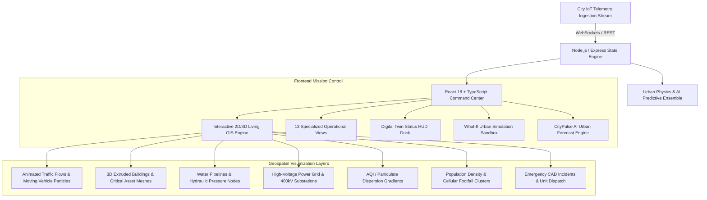

# 🏙️ CITYPULSE TWIN
### *“AI-Powered Living Digital Twin for Urban Intelligence”*

[](https://github.com/)
[](https://github.com/)
[](https://github.com/)
[](https://github.com/)

---

## 🌐 Executive Summary & Vision

**CITYPULSE TWIN** is a mission-control, enterprise-grade digital twin platform engineered for:
- **Smart City Command Centers**
- **Municipal Corporations & Urban Planners**
- **Emergency Management & Disaster Teams**
- **Transportation Authorities & Traffic Management Centers**
- **Energy, Water, and Utility Grid Operators**

The platform continuously synthesizes and models real-time multimodal urban telemetry across traffic flows, water hydraulics, electrical grids, atmospheric emissions, population footfall, and civil infrastructure.

Designed with a sophisticated dark command-center aesthetic inspired by **Palantir-style operational intelligence** and **NVIDIA Omniverse digital twin visualization**.

---

## 🏛️ System Architecture



---

## 🚀 Key Modules & Capabilities

### 1. 🗺️ Centerpiece: Living 2D/3D Digital Twin Map (`/digital-twin`)
- **Particle Traffic Simulation**: Thousands of glowing moving particle agents animated along arterial and highway corridors with real-time velocity and congestion indicators:
  - 🟢 **Green**: Free flow (>60 km/h)
  - 🟡 **Yellow**: Moderate flow (40-60 km/h)
  - 🟠 **Orange**: Congested (20-40 km/h)
  - 🔴 **Red**: Severe bottleneck / Incident (<20 km/h)
- **3D Extrusions**: Structural heights with status glow for commercial, residential, industrial, and critical government infrastructure.
- **Dynamic Layer Toggles**:
  - ☑ Traffic Flow & Particle Agents
  - ☑ Roads & Highways Hierarchy
  - ☑ 3D Building Meshes
  - ☑ Water Network (Mains, Booster Pumps, Reservoirs)
  - ☑ Power Grid (Transmission lines, 400kV Substations)
  - ☑ Pollution Dispersion (AQI Contours)
  - ☑ Population Density (Cellular Footfall Clusters)
  - ☑ Emergency Incidents & Live Squads
  - ☑ Public Transit Fleet
- **Interactive Asset Inspector**: Click any road, pipe, transformer, or building to open the live telemetry drawer.

### 2. 📊 Digital Twin Operational Status Panel (Right Dock)
- **Master City Health Score**: Dynamic circular radial gauge (`87 / 100`) with real-time trend analytics.
- **Dynamic Subsystem Breakdown**:
  - **Traffic**: `72%` *(+12% congestion ↑ compared with previous hour)*
  - **Water Network**: `94%` *(Nominal pressure 4.2 bar)*
  - **Power Grid**: `91%` *(+14% peak surge projected)*
  - **Air Quality**: `68%` *(-8% PM2.5 ↓ improving)*
  - **Infrastructure**: `89%` *(2 vibration alerts)*
  - **Population Mobility**: `76%` *(High transit density)*

### 3. 🔮 CityPulse AI Urban Forecast Engine (`/predictions`)
- **Traffic Forecast**: CBD congestion probability **87%** (Window: 18:20–19:10), root-cause analysis, adaptive signal timing playbook.
- **Water Shortage Forecast**: North District probability **73%** within 48h, reservoir drainage gradient, automated supply redistribution.
- **Power Peak Demand Forecast**: **4.8 GW** peak (+14%) at **19:30**, battery BESS discharge scheduling.
- **Pollution Hotspot**: Industrial Corridor AQI **218** forecast, atmospheric thermal inversion entrapment analysis.
- **Predictive GIS Layer**: Time-scrubbing "+60 MIN FORECAST" projection overlay.

### 4. 🧪 What-If Urban Simulation Sandbox (`/simulation`)
- Inject critical disaster scenarios:
  - **Coastal Viaduct / Bridge Sudden Closure**
  - **Substation Alpha 400kV Transformer Trip (Catastrophic Blackout)**
  - **100-Year Storm Surge & Flash Inundation**
  - **International Summit / Mega-Concert Surge**
- Custom stress sliders: Inundation level (0-3m), traffic influx surge (-50 to +100%), grid demand surge (0 to +50%), meteorological conditions.
- Real-time physics recalculation: City health score drop, commute delays, power deficits, water stress, emergency squads needed, and economic cost per hour.

---

## 🗂️ Navigational Structure

| Route | View Name | Description |
|---|---|---|
| `/digital-twin` | **Digital Twin GIS** | 2D/3D Living GIS map with traffic particles & layer toggles |
| `/dashboard` | **Municipal Overview** | Executive KPIs, cross-utility curves, incident feed |
| `/traffic` | **Traffic & Mobility** | Arterial flow, speed distributions, 142 adaptive signal plans |
| `/water` | **Water Distribution** | Reservoir capacities, hydraulic gradients, acoustic leak alerts |
| `/energy` | **Power Grid** | 4.8 GW peak forecast, substation thermal status, generation mix |
| `/pollution` | **Air Quality & AQI** | PM2.5/PM10/NO2/O3 breakdown, wind vectors, plume tracking |
| `/population` | **Population Mobility** | Cellular footfall clusters, transit hub load (82.4%), evacuation rate |
| `/infrastructure` | **Infrastructure (SHM)** | Bridge/tunnel piezo strain gauges, vibration, road IRI (1.85) |
| `/simulation` | **What-If Sandbox** | Multi-variable disaster simulation & autonomous playbooks |
| `/predictions` | **AI Forecast Engine** | Deep temporal AI prediction cards & single-click mitigation |
| `/incidents` | **Emergency CAD** | CAD incident triage queue, unit dispatch, SLA countdown |
| `/analytics` | **Analytics & SLAs** | 24-hour historical performance, Pearson correlation matrix |
| `/settings` | **System Settings** | 3D graphics LOD (1-3), WebSocket rate (1-5s), AI governance |

---

## 🛠️ Technology Stack

- **Frontend**:
  - React 18 & TypeScript
  - Vite for ultra-fast HMR and bundling
  - Tailwind CSS (Palantir/Omniverse dark command-center aesthetic)
  - Custom HTML5 Canvas 2D/3D Particle Simulation Engine
  - Recharts & Framer Motion
  - Lucide React Icons
- **Backend**:
  - Node.js & Express.js with TypeScript (`tsx`)
  - WebSocket Server (`ws`) for high-frequency IoT streaming
  - Mathematical & Physics-based Scenario Simulation Engine
  - High-density GeoJSON models for 6 global smart cities

---

## ⚡ Getting Started

### Prerequisites
- Node.js (v18 or newer)
- npm (v9 or newer)

### Installation & Launch

1. **Clone or navigate to the project directory**:
   ```bash
   cd UrbanSynx
   ```

2. **Install all dependencies (root, server, and client)**:
   ```bash
   npm run install:all
   ```

3. **Start the Full-Stack Application**:
   ```bash
   npm run dev
   ```

4. **Access the Web Application**:
   - **Frontend UI**: [http://localhost:5173](http://localhost:5173)
   - **Backend Telemetry API**: [http://localhost:5000/api/cities](http://localhost:5000/api/cities)
   - **WebSocket Stream**: `ws://localhost:5000/ws`

---

## ⌨️ Keyboard Shortcuts & Productivity
- `Ctrl + K` / `Cmd + K`: Open the Universal Command Palette to search sensors, hydrants, substations, and incident dispatch records.
- `Esc`: Close open drawers and modals.

---

## 📜 License
CITYPULSE TWIN is proprietary municipal intelligence software designed for smart-city operations and infrastructure command centers.
